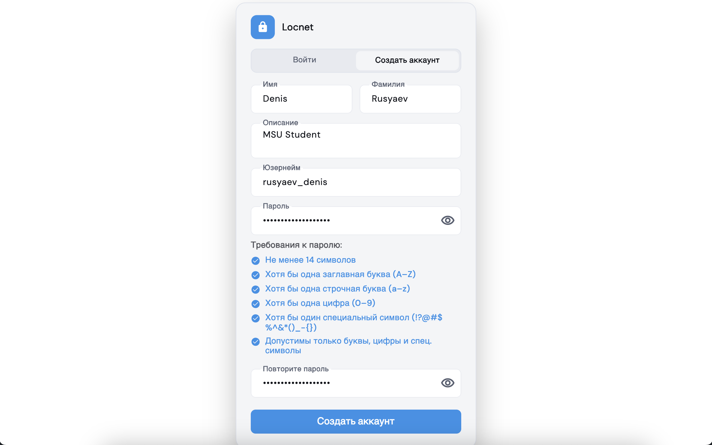
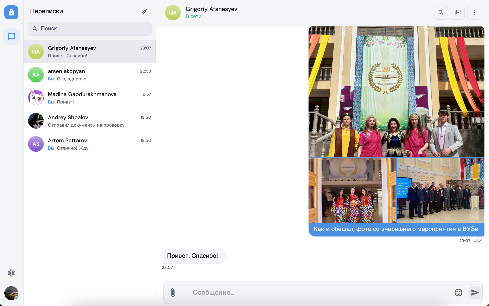
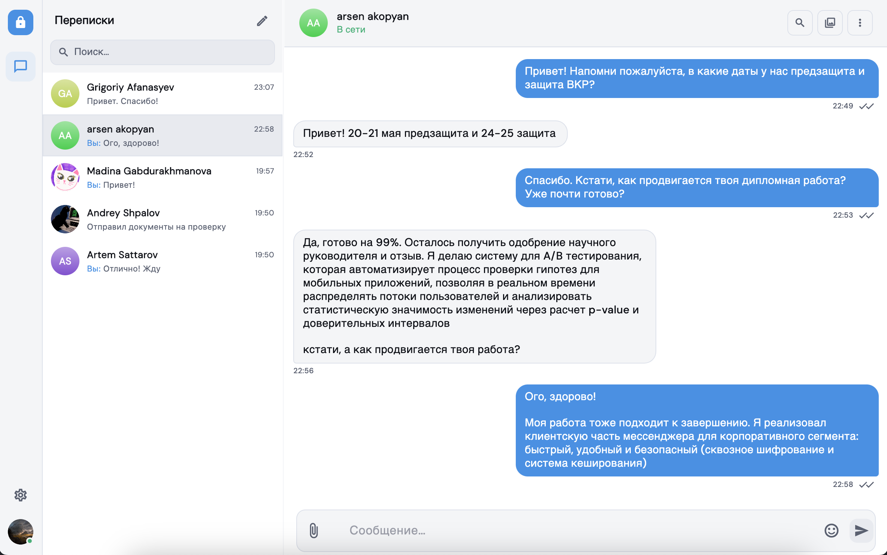
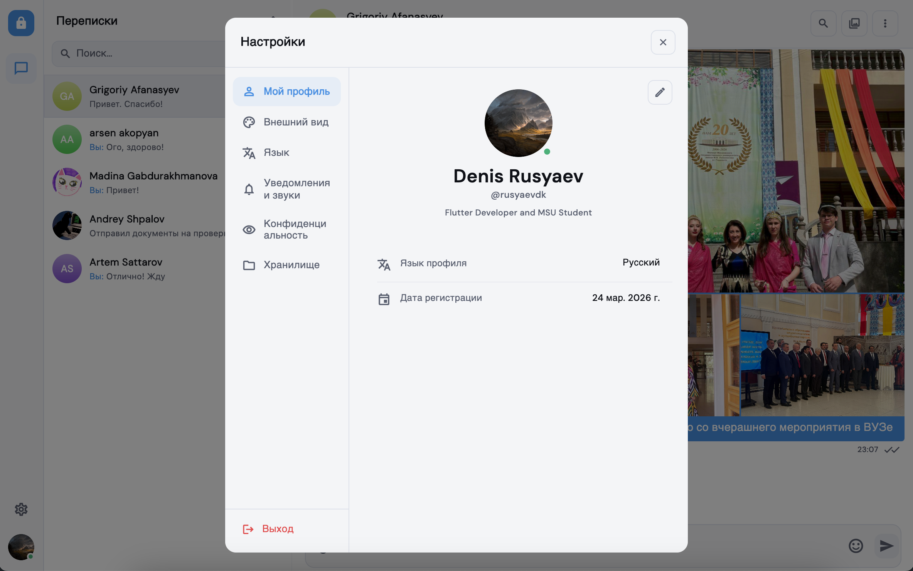
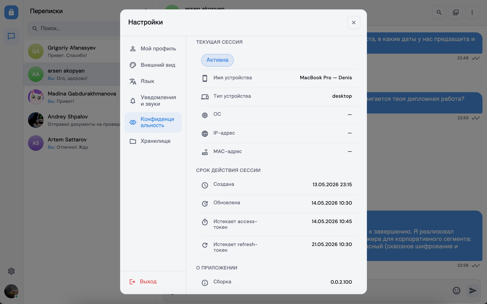
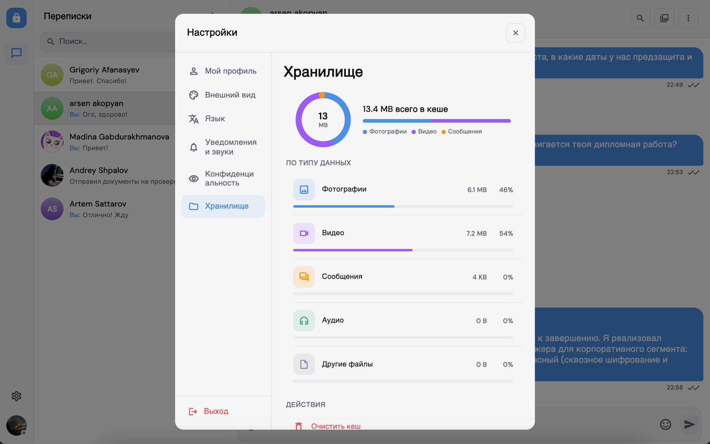

# Locnet App

**Требования:** Flutter 3.38.x, Dart 3.9.2+  
**Платформы:** macOS, Windows, Web

## Скриншоты

### Регистрация



### Чат





### Настройки







## Архитектура

### Слои


| Слой             | Ответственность                                                   | Расположение                                                           |
| ---------------- | ----------------------------------------------------------------- | ---------------------------------------------------------------------- |
| **Presentation** | UI (виджеты, экраны), состояние (`Bloc` / `Cubit`), навигация     | `lib/features/*/presentation/`, `lib/core/presentation/`, `lib/uikit/` |
| **Domain**       | Бизнес-правила, **interactors** (use cases), доменные модели      | `lib/features/*/domain/`, `lib/core/domain/`                           |
| **Data**         | Реализации репозиториев, HTTP/WebSocket, DTO, локальное хранилище | `lib/features/*/data/`, `lib/core/data/`                               |


### Модули (`lib/features/`)


| Модуль                            | Назначение                                                              |
| --------------------------------- | ----------------------------------------------------------------------- |
| `auth`                            | регистрация, вход, восстановление сессии                                |
| `conversations_list`              | список бесед, real-time обновления; `unified_search` — глобальный поиск |
| `conversation`                    | экраны бесед: `private`, `group`, `channel`, `conversation_creator`     |
| `message`                         | сообщения, ввод, медиа, эмодзи, выделение, пересылка                    |
| `settings`                        | тема, язык, масштаб UI, настройки чата и кеширования                    |
| `passcode`                        | блокировка приложения PIN-кодом                                         |
| `side_panel`                      | боковая панель навигации (desktop/web)                                  |
| `server_config`                   | переопределение BASE_URL / socket URL                                   |
| `home`, `root`, `splash`, `error` | оболочка приложения и служебные экраны                                  |


### Окружения (env presets)


| `APP_ENV` | Поведение                                                                                            |
| --------- | ---------------------------------------------------------------------------------------------------- |
| `dev`     | преимущественно **mock**-репозитории + `MockInMemoryBackend`, Drift-кэш для списка бесед и сообщений |
| `stage`   | **HTTP**-репозитории + `DriftCached`* декораторы, реальный бэкенд из `env/stage.env`                 |
| `prod`    | пресет в разработке (часть фабрик — `UnimplementedError`)                                            |


Переключение реализаций без смены UI-кода: один контракт `IAppEnvPreset`, разные `*EnvPreset`.

## Технологический стек

### Ядро


| Область      | Технология                                                                  |
| ------------ | --------------------------------------------------------------------------- |
| SDK          | Flutter 3.38.x, Dart ^3.9.2                                                 |
| Состояние    | `flutter_bloc`, `bloc`, `bloc_concurrency`, `stream_transform`, `equatable` |
| Навигация    | `go_router`                                                                 |
| DI           | `provider`, `flutter_bloc` (`RepositoryProvider`, `BlocProvider`)           |
| HTTP         | `dio` + обёртка `DioHttpClient` (`IHttpClient`)                             |
| Real-time    | `socket_io_client` (список бесед и события)                                 |
| Локальная БД | `drift`, `drift_flutter`, `sqlite3` (шифрование **sqlite3mc** на native)    |
| Key-value    | `flutter_secure_storage`, `shared_preferences` (`StorageAggregator`)        |
| Конфигурация | `flutter_dotenv` (`env/dev.env`, `stage.env`, `prod.env`)                   |
| Логирование  | `talker_flutter`, `talker_dio_logger`, `talker_bloc_logger`                 |
| Локализация  | `flutter_localizations`, `intl`, `intl_utils` (основная локаль: **ru**)     |
| Ассеты       | `flutter_gen` (SVG, Lottie)                                                 |


### UI и медиа


| Область           | Технология                                 |
| ----------------- | ------------------------------------------ |
| Шрифты            | `google_fonts`                             |
| Вектор / анимации | `flutter_svg`, `lottie`, `flutter_animate` |
| Изображения       | `cached_network_image`                     |
| Вложения          | `file_picker`, `video_player`              |
| Markdown          | `flutter_markdown`, `markdown`             |
| Прочее            | `url_launcher`, `cupertino_icons`          |


### Платформа


| Область           | Технология                              |
| ----------------- | --------------------------------------- |
| Устройство / сеть | `device_info_plus`, `network_info_plus` |
| Web               | `web`, `js`                             |
| Криптография      | `crypto`, `uuid`                        |


### Тестирование и codegen


| Область     | Технология                                        |
| ----------- | ------------------------------------------------- |
| Unit / bloc | `flutter_test`, `bloc_test`, `mocktail`           |
| Codegen     | `build_runner`, `drift_dev`, `flutter_gen_runner` |
| Линтер      | `flutter_lints`                                   |


## Сборка и запуск

```bash
git clone <repository-url>
cd locnet_app
flutter pub get
dart run build_runner build --delete-conflicting-outputs
flutter run
```

Точка входа — `lib/main.dart`. Окружение задаётся `**APP_ENV**` (`dev`, `stage`, `prod`); по умолчанию — `stage`.

```bash
flutter run --dart-define=APP_ENV=dev
flutter run --dart-define=APP_ENV=prod
flutter run -d macos --dart-define=APP_ENV=stage
flutter run -d chrome --web-port=63192 --dart-define=APP_ENV=stage
```

Release-сборка macOS (без `APP_ENV` используется `stage`):

```bash
flutter build macos --release
flutter build macos --release --dart-define=APP_ENV=prod
```

## Конфигурация

Файлы `env/<env>.env` подключаются в assets и загружаются в runtime по `APP_ENV`:


| Переменная        | Назначение            |
| ----------------- | --------------------- |
| `BASE_URL`        | REST API              |
| `BASE_SOCKET_URL` | WebSocket / Socket.IO |


Значения можно переопределить в runtime через экран **Server config** (`ServerConfigCubit` обновляет `ApiConfig` и `dio.options.baseUrl`).

**Локализация:** `flutter gen-l10n` (ARB в `lib/l10n/`, вывод в `lib/gen/l10n/`).  
**Ассеты:** `dart run build_runner build` / `flutter pub run flutter_gen`.

