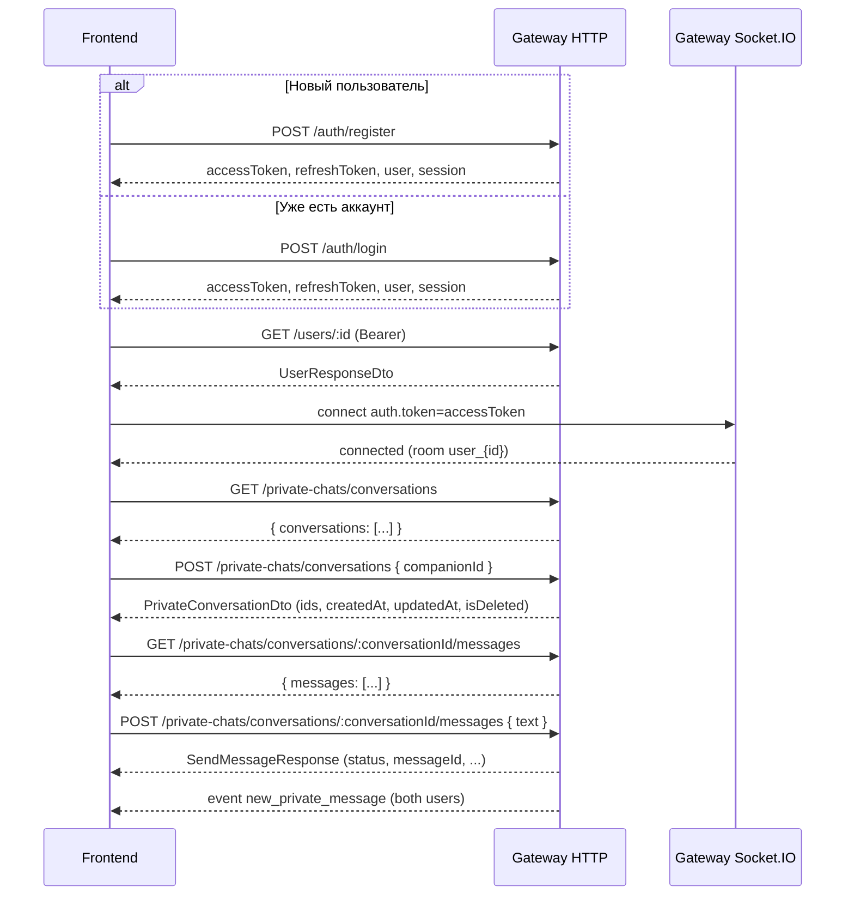
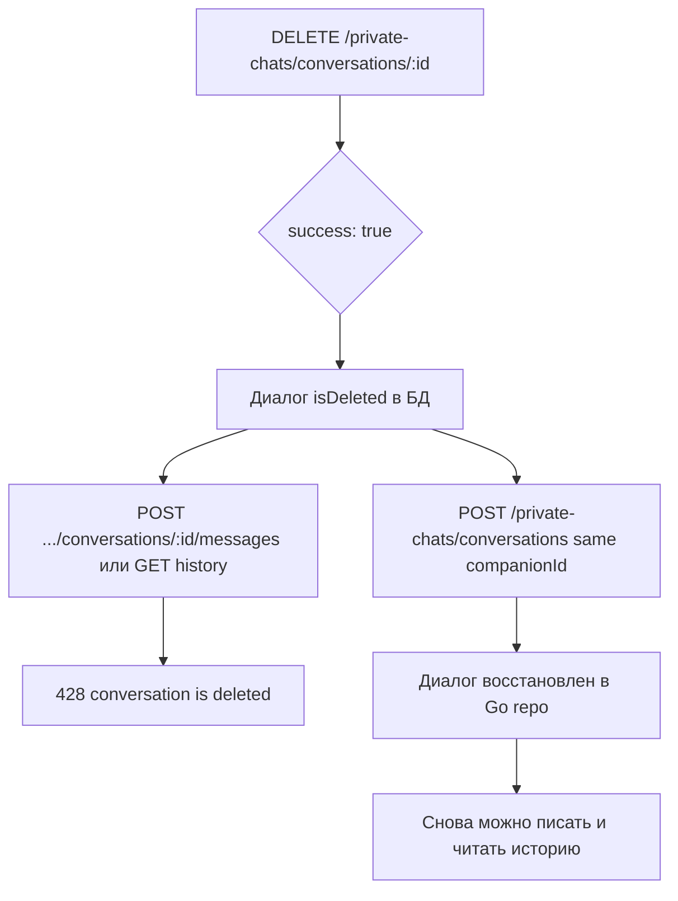
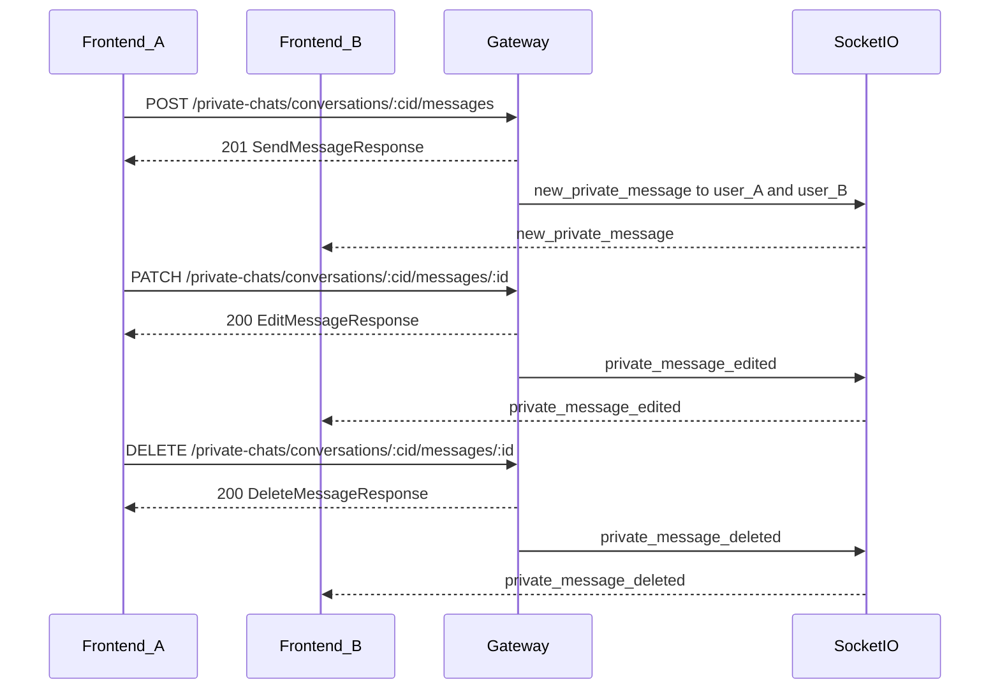

# Gateway API и WebSocket — руководство для фронтенда

Единый ориентир по публичному API **gateway-service** (HTTP + Socket.IO). Интерактивные схемы: **`GET /docs`** (Swagger UI). Базовый URL по умолчанию: **`http://<host>:3000`** (порт: **`process.env.PORT`** или **`process.env.port`**, в Docker Compose обычно **`PORT: 3000`**).

Долгосрочная целевая модель и расширенные DTO описаны в [BACKEND_SPEC.md](./BACKEND_SPEC.md). Детали только про сокеты (частично дублируются здесь) — в [WEBSOCKET_SPEC.md](./WEBSOCKET_SPEC.md). **Каноничный гайд для интеграции фронтенда с текущим gateway — этот файл.**

---

## Сверка Swagger (`/docs`) и фактического runtime

Раньше в OpenAPI были расхождения с реальными JSON-ответами. В коде gateway добавлены DTO-обёртки и классы ответов; после деплоя актуальной версии **Swagger должен совпадать** с описанием ниже.

| Тема | Было в Swagger (вводило в заблуждение) | Фактический JSON / что сделано |
|------|----------------------------------------|--------------------------------|
| `GET /private-chats/conversations` | Массив диалогов без обёртки | **`{ "conversations": [...] }`**. Схема: `ConversationsListResponseDto`. |
| `DELETE /private-chats/conversations/:id` | Только `success` | **`success`** и опционально **`conversation`** (снимок диалога после soft-delete, как `PrivateConversationDto`). Схема: `DeleteConversationResponseDto`. |
| `POST /private-chats/conversations/:conversationId/messages` | `PrivateMessageDto` с полем `id` | **`conversationId`** только в path. Ответ: **`messageId`**, **`receiverId`**, **`status`**, **`conversationUpdatedAt`**, вложения и пр. Схема: `SendMessageResponseDto`. В WS **`deliveryStatus`** вместо **`status`**. |
| `GET /private-chats/conversations/:conversationId/messages` | Массив `PrivateMessageDto` | **`{ "messages": [...] }`**, элементы: **`id`**, **`text`**, **`senderId`**, **`createdAt`**, **`editedAt`**, **`isDeleted`**, **`deletedAt`**, **`deletedById`**, **`hasAttachments`**, **`attachments`** (массив `PrivateMessageAttachmentHistoryDto`: `mediaId`, `mimeType`, `status`, `blurHash`). Пустые строки для необязательных полей — см. DTO. Доступ только **участникам** диалога. |
| Медиа (MinIO) | — | **`POST /media/init`**, **`POST /media/:mediaId/complete`**, **`GET /media/:mediaId/metadata`**, **`GET /media/:mediaId/download`**, **`DELETE /media/:mediaId`**. См. раздел «Медиа» и «Аватар». |
| `PATCH` / `DELETE` … `/private-chats/conversations/:cid/messages/:messageId` | — | **`conversationId`** только в path. Body PATCH: только **`text`**. Схемы: **`EditPrivateMessageDto`**, **`EditMessageResponseDto`**, **`DeleteMessageResponseDto`**. |
| `GET /private-chats/conversations/tiles` | — | **`{ "tiles": [...] }`** — плитки чатов (`ConversationTileResponseDto`: превью последнего сообщения, **`companion.userId`**, `languageCode` и пр.). |
| `GET /search/unified` | — | Query **`q`** (обяз.), **`limit`**, **`page`**. Ответ: **`users`**, пустые **`groups`** / **`channels`**, **`conversations`** (приватные совпадения). |
| Диалог в списке / создание / обновление | Неполная схема в Swagger | Ответ: **`conversationId`**, **`user1Id`**, **`user2Id`**, **`createdAt`**, **`updatedAt`**, **`isDeleted`** (`PrivateConversationDto` = gRPC `ConversationResponse`). |
| Пользователь в auth/users | — | В JSON пользователя идентификатор — поле **`id`**, не `userId` (в JWT payload субъект обычно совпадает с этим UUID). |
| `POST /auth/login` | Не было явной **401** | В Swagger добавлен ответ **401** (`ApiUnauthorizedResponse`). |

Если что-то снова разойдётся с `/docs`, приоритет у поведения gateway и таблиц в этом документе.

---

## Авторизация

### HTTP

- Заголовок: **`Authorization: Bearer <accessToken>`** для всех маршрутов, кроме перечисленных в разделе «без JWT».
- Токены выдаются при **`POST /auth/register`**, **`POST /auth/login`**, **`POST /auth/refresh`** (см. тела ответов — `accessToken`, `refreshToken`, `session`, сроки `accessExpiresAt` / `refreshExpiresAt`).
- Типичный цикл при **401** на защищённом маршруте: вызвать **`POST /auth/refresh`** с `refreshToken` и `sessionId` из последнего ответа авторизации; при неудаче — снова логин.

### Маршруты без JWT

Только префикс **`/auth/*`**:

- `POST /auth/register`
- `POST /auth/login`
- `POST /auth/refresh`
- `POST /auth/logout`

Все остальные описанные здесь HTTP-ручки требуют валидный Bearer access token.

---

## Медиа (presigned URL, MinIO)

Один **bucket** и один набор HTTP-ручек на gateway; **media-service** не привязан к приватным чатам — в БД хранится **`scope`** и **`scope_id`** (диалог, пользователь для аватара, id группы/канала и т.д.). Проверка «можно ли инициировать загрузку в этом контексте» делается на **gateway** (JWT + вызовы доменных сервисов), а «готов ли объект и владелец ли отправитель» — в **private-service** и media при отправке сообщения.

1. **`POST /media/init`** — тело: **`scope`**, **`scopeId`**, `fileName`, `mimeType`, `sizeBytes`, опционально `clientDedupeKey`. Ответ: `mediaId`, `uploadUrl`, `expiresAt`, `requiredHeaders`, **`metadata`** — объект **`MediaMetadata`** (без исходного имени файла): `mimeType`, `sizeBytes`, `status`, `scope`, `scopeId`, `ownerUserId`, `createdAt`, `updatedAt`, `etag`.
2. Клиент выполняет **HTTP PUT** на `uploadUrl` **напрямую в MinIO** с телом файла (и заголовками из `requiredHeaders`). Gateway **не** принимает тело файла.
3. **`POST /media/:mediaId/complete`** — после успешного PUT (опционально `etag`, `contentLength`). Ответ: `mediaId`, `status`, **`metadata`** (тот же состав, что после init, с актуальными полями после проверки в хранилище).
4. **`GET /media/:mediaId/metadata`** — только метаданные (без presigned URL); права доступа как у **`GET …/download`** (владелец или `user_profile` для любого авторизованного пользователя).
5. **`POST /private-chats/conversations/:conversationId/messages`** — **`attachments`**: `{ "mediaId", "fileType" }` (опционально `attachmentId`). Объекты должны быть **`ready`**; владелец вложений = отправитель (проверка в связке private-service ↔ media).
6. **`GET /media/:mediaId/download`** — presigned GET; в JSON дополнительно **`scope`**, **`scopeId`**, **`ownerUserId`**, **`createdAt`**, **`updatedAt`**, **`etag`** (дублируют `metadata`, чтобы не делать второй запрос). **Владелец** и файлы с scope **`user_profile`** — без query. Для доступа по контексту — **`?scope=…&scopeId=…`** и **`MEDIA_INTERNAL_GRPC_KEY`**.
7. **`DELETE /media/:mediaId`** — удаление **владельцем**; при успехе в ответе опционально **`metadata`** — снимок до удаления. Если объект ещё в `avatarId`, сначала обнулите профиль через **`PUT /users/:userId`**.

### Аватар (`user_profile`) и регистрация

**`POST /auth/register`** не передаёт бинарник: только учётные данные и профиль (имя и т.д.). Чтобы выставить аватар после регистрации (или логина):

1. Из ответа возьмите **`user.id`** (тот же UUID, что в JWT `sub`).
2. **`POST /media/init`** — `scope: "user_profile"`, **`scopeId`** = этот UUID (должен совпадать с текущим пользователем по JWT).
3. **HTTP PUT** на `uploadUrl` в MinIO, затем **`POST /media/:mediaId/complete`**.
4. **`PUT /users/:userId`** (только свой `userId`) — **`{ "avatarId": "<mediaId>" }`**. Gateway проверяет в media-service, что файл **`ready`**, владелец = вы, **`scope`/`scope_id`** соответствуют **`user_profile`** и вашему id (нельзя подставить медиа из чата).

**Смена аватара:** повторите шаги 2–4; предыдущий объект media удаляется на gateway **после** успешного обновления профиля (best effort).

**Убрать аватар:** **`PUT`** с **`"avatarId": null`** или пустой строкой — старый media удаляется так же best effort.

**Метаданные в ответах пользователя:** при успешном запросе к **`GET /users/me`**, **`GET /users/:id`**, **`PUT /users/:id`**, а также в **`user`** из **`POST /auth/register`**, **`/login`**, **`/refresh`**, в **`users`** из **`GET /search/unified`** и в **`companion`** плиток **`GET /private-chats/conversations/tiles`**, если задан **`avatarId`**, поле **`avatarMedia`** содержит тот же набор полей, что **`MediaMetadata`** (или отсутствует, если media недоступен).

**Показать картинку:** **`GET /media/:avatarId/download`** (или сначала **`GET /media/:avatarId/metadata`**).

В Docker Compose по умолчанию API MinIO: **`http://<host>:9000`** (логин/пароль см. переменные `MINIO_ROOT_*` в compose). Для браузера может понадобиться CORS на стороне MinIO и доступность хоста из presigned URL (часто тот же хост, что видит клиент).

### Автотесты (скрипты)

- Проверка форм ключевых JSON-ответов (с хоста, gateway на localhost): **`npm run verify:frontend-api`**.
- Полный медиа-flow (init → PUT MinIO → complete → сообщение с несколькими типами файлов, «большой» файл, негативные кейсы, presigned GET) выполняется **внутри сети Docker** — сервис **`e2e-media-tests`** (profile **`e2e`**):  
  `cd infra && docker-compose --profile e2e run --rm e2e-media-tests`  
  Переменные: **`E2E_LARGE_MB`** (по умолчанию в compose 2), **`E2E_SKIP_LARGE=1`** чтобы пропустить большой файл, **`BASE`** (по умолчанию `http://gateway-service:3000`).
- Полная пересборка стека, оба скрипта и хвосты логов: **`npm run test:e2e-media:docker`** (см. [`scripts/run-docker-stack-and-e2e.sh`](../scripts/run-docker-stack-and-e2e.sh); при **`ENOSPC`** сначала `docker system prune -af`; при нехватке времени на сборку: **`BUILD_NO_CACHE=0`**).

### Логи приложения в PostgreSQL (Aiven)

- Gateway в Docker шлёт события в **`logging-service`** по gRPC; **куда пишет Prisma** — задаётся **`LOGGING_DATABASE_URL`** у контейнера `logging-service`.
- Чтобы **все** строки уходили в **Aiven** (или другой внешний Postgres), задайте в **корне репозитория** файл **`.env`** с `LOGGING_DATABASE_URL=postgresql://...?sslmode=require&...` и поднимайте стек так, чтобы compose подставил переменные из этого файла:
  - **`cd infra && docker compose --env-file ../.env up -d`**
- Скрипт **`npm run test:e2e-media:docker`** при наличии `../.env` вызывает compose с **`--env-file`** автоматически.
- Сборка образа `logging-service` **не** передаёт секрет в `docker build` (только placeholder для `prisma generate`); реальный URI — только в **runtime** `environment`.
- Локальный контейнер **`postgres-logs`** в compose остаётся для режима без внешней БД (fallback в `docker-compose.yml`). Если `LOGGING_DATABASE_URL` указывает на внешний хост, приложение в этот Postgres не пишет; сводка: **`python3 scripts/query-logging-db-summary.py`** (с загруженным `.env`).

---

## Correlation ID (сквозная трассировка)

- На **каждый HTTP-запрос** gateway назначает UUID (или принимает ваш, см. ниже) и возвращает его в заголовке ответа **`X-Correlation-Id`**. Тело успешных ответов **не меняется** — идентификатор только в заголовке.
- **Опционально** клиент может передать свой UUID **v4** в запросе заголовком **`X-Correlation-Id`** или **`X-Request-Id`**. Невалидное значение игнорируется, будет сгенерирован новый UUID.
- При **ошибках** тот же id дублируется в заголовке **`X-Correlation-Id`** и в JSON поле **`correlationId`** (наряду с `statusCode`, `message`, …), чтобы удобнее парсить в клиентах, которые не читают заголовки.
- События Socket.IO, которые gateway шлёт **после успешного REST** (отправка / правка / удаление сообщения), могут содержать опциональное поле **`correlationId`** с тем же значением, что и у вызвавшего HTTP-запроса — см. [WEBSOCKET_SPEC.md](./WEBSOCKET_SPEC.md).

---

## Формат ошибок (HTTP)

Глобальный фильтр приводит ответ к виду:

```json
{
  "statusCode": 401,
  "message": "строка или массив строк валидации",
  "timestamp": "2025-03-25T12:00:00.000Z",
  "path": "/private-chats/conversations/…/messages",
  "correlationId": "550e8400-e29b-41d4-a716-446655440000"
}
```

Поле **`correlationId`** присутствует, когда контекст запроса активен; заголовок **`X-Correlation-Id`** дублирует то же значение.

Типичные коды:

| Код | Когда |
|-----|--------|
| **400** | Некорректный запрос (в т.ч. после маппинга части ошибок). |
| **401** | Нет/просрочен JWT; неверный логин/пароль. |
| **403** | Запрещено (например, чужой профиль при `PUT /users/:userId`). |
| **404** | Не найдено (в т.ч. gRPC `NOT_FOUND`; `UNAVAILABLE` в gateway маппится в **404**). |
| **405** | gRPC `CANCELLED` / `ABORTED` → `METHOD_NOT_ALLOWED`. |
| **422** | Ошибка валидации DTO / `INVALID_ARGUMENT` из gRPC. |
| **428** | gRPC `FAILED_PRECONDITION`: удалённый диалог (**`conversation is deleted`**) при отправке/истории; **редактирование уже удалённого сообщения** (**`message is deleted`**); другие нарушения предусловий. |
| **502** | gRPC `UNKNOWN` и пр. — «плохой шлюз» / проблема ниже по цепочке. |

Точный текст `message` для gRPC-ошибок приходит из `details` от сервиса.

---

## REST API

Общие замечания:

- Тела запросов с неизвестными полями при **`forbidNonWhitelisted: true`** дают ошибку валидации.
- Даты в ответах бэкенда часто приходят **строками**; от Go возможен формат вида **`2006-01-02 15:04:05.999999999 +0000 UTC`**, не только ISO. Имеет смысл парсить устойчиво (например, нормализовать строку или использовать библиотеку дат) либо договориться о нормализации на бэкенде позже.

### Auth (`/auth`)

#### `POST /auth/register`

- **Bearer:** не нужен.
- **Body:** `RegisterDto` — `username` (4–50), `password` (min 8), `firstName`, `lastName`, опционально `patronymic`, `description`, `deviceInfo` (`IPAddress`, `macAddress`, `deviceName`, `deviceType`, `OS` — все опциональны).
- **Ответ 201:** объект как `AuthResponseDto`: `accessToken`, `refreshToken`, `accessExpiresAt`, `refreshExpiresAt`, `user` (`UserResponseDto`), `session` (`SessionResponseDto`), опционально `errorMessage`.
- **UI:** сохранить токены и `session.sessionId` для refresh/logout.

#### `POST /auth/login`

- **Bearer:** не нужен.
- **Body:** `username`, `password`, опционально `deviceInfo`.
- **Ответ 200:** как у register (`AuthResponseDto`).
- **401:** неверные учётные данные.
- **UI:** то же хранение, что после регистрации.

#### `POST /auth/refresh`

- **Bearer:** не нужен.
- **Body:** `refreshToken`, `sessionId` (UUID), опционально `deviceInfo`.
- **Ответ 200:** снова полный `AuthResponseDto` с новой парой токенов.

#### `POST /auth/logout`

- **Bearer:** не нужен (токены передаются в теле сессии).
- **Body:** `sessionId` (UUID).
- **Ответ 200:** тело — объект **сессии** (`SessionResponseDto`), как в поле `session` у login/register (в коде возвращается `result.session`).

**Пример фрагмента `user` в ответе auth:**

```json
{
  "id": "550e8400-e29b-41d4-a716-446655440000",
  "username": "alice",
  "firstName": "Alice",
  "lastName": "Smith",
  "patronymic": null,
  "description": null,
  "avatarId": null,
  "isDeleted": false,
  "isBanned": false,
  "createdAt": "...",
  "updatedAt": "..."
}
```

---

### Users (`/users`)

Все методы — **с Bearer**.

#### `GET /users/me`

- **Параметры:** нет (профиль берётся из JWT).
- **Ответ 200:** тот же `UserResponseDto`, что и у `GET /users/:userId` для текущего пользователя (поле **`id`**).
- **Ошибки:** 401 и др.

#### `GET /users/:userId`

- **Параметры:** `userId` — UUID.
- **Ответ 200:** `UserResponseDto` (поле пользователя — **`id`**).
- **Ошибки:** 401, 404 и др.

#### `PUT /users/:userId`

- **Ограничение:** в JWT `sub` / `userId` должен совпадать с `:userId`, иначе **403** «You can only update your own profile».
- **Body:** все поля опциональны: `firstName`, `lastName`, `username`, `patronymic`, `description`, `avatarId` (UUID).
- **Ответ 200:** обновлённый `UserResponseDto`.

---

### Sessions (`/sessions`)

#### `GET /sessions`

- **Bearer:** нужен.
- **Ответ 200:** **массив** `SessionResponseDto[]` (без обёртки `{ sessions: ... }`).
- **UI:** список активных сессий устройств; для refresh используется та сессия, что пришла при login.

---

### Private Chats (`/private-chats`)

Все методы — **с Bearer**. Пользователь определяется из JWT (`req.user.userId`).

**Типичный порядок для UI:** создать/получить диалог (**`POST /private-chats/conversations`**) → подключить Socket.IO с access token **после** того, как токен актуален → подписаться на **`private_conversation_upsert`** (список чатов), **`new_private_message`**, **`private_message_edited`**, **`private_message_deleted`** → отправка и правка сообщений **только по HTTP** (см. ниже). События WS приходят **обоим** участникам; сокет должен быть **`connected`** до ожидания push.

#### `GET /private-chats/conversations`

- **Query:** `limit` (1–100, по умолчанию 50), `offset` (≥ 0, по умолчанию 0), опционально **`page`** (целое ≥ 1). Если передан **`page`**, смещение считается как **`offset = (page - 1) * limit`**, а явный **`offset` в query игнорируется**.
- **Ответ 200:**

```json
{
  "conversations": [
    {
      "conversationId": "…",
      "user1Id": "…",
      "user2Id": "…",
      "createdAt": "…",
      "updatedAt": "…",
      "isDeleted": false
    }
  ]
}
```

- **UI:** показать список; участника-собеседника вычислить как тот из `user1Id` / `user2Id`, который не равен текущему `user.id`.

#### `GET /private-chats/conversations/tiles`

- **Query:** как у списка диалогов — `limit` (1–100), `offset` (≥ 0), **`page`** (те же правила, что у `GET /private-chats/conversations`).
- **Ответ 200:** `{ "tiles": [ { "conversationId", "type": "private", "title", "description", "lastMessageText?", "lastMessageSenderId?", "lastMessageAt?", "updatedAt", "companion": { "userId", "username", "firstName", "lastName", "patronymic?", "languageCode", "description?", "avatarId?", "isDeleted", "isBanned", "createdAt", "updatedAt" } | null } ] }`.
- **Назначение:** главный экран списка чатов (как в Telegram): превью последнего **не** soft-delete сообщения и профиль собеседника из auth. Если профиль не найден, `companion` может быть `null`.

#### `POST /private-chats/conversations`

- **Body:** `{ "companionId": "<uuid>" }` — UUID второго участника.
- **Ответ 201:** один объект диалога: `conversationId`, `user1Id`, `user2Id`, `createdAt`, `updatedAt`, `isDeleted`.
- **Логика soft-delete / восстановление:** если диалог с этой парой пользователей уже существовал и был помечен удалённым, повторный **POST** с тем же `companionId` **восстанавливает** диалог (см. `GetOrCreateConversation` в private-service-go). После восстановления снова можно слать сообщения и читать историю.

#### `PUT /private-chats/conversations/:conversationId`

- **Body:** опционально `{ "isDeleted": true | false }` — soft-delete для **всего** диалога (флаг в БД на пару участников).
- **Ответ 200:** те же поля, что у элемента списка: `conversationId`, `user1Id`, `user2Id`, `createdAt`, `updatedAt`, `isDeleted`.

#### `DELETE /private-chats/conversations/:conversationId`

- **Body:** нет.
- **Ответ 200:** `success: true` и **`conversation`** — актуальный снимок диалога (`isDeleted: true`); gateway рассылает **`private_conversation_upsert`** обоим участникам.

#### `GET /private-chats/conversations/:conversationId/messages`

- **Query:** `limit` (int, опционально, по умолчанию 20), `offset` (int, опционально, по умолчанию 0), опционально **`page`** (≥ 1): **`offset = (page - 1) * limit`**, при наличии **`page`** явный **`offset` игнорируется**.
- **Ответ 200:**

```json
{
  "messages": [
    {
      "id": "…",
      "text": "…",
      "senderId": "…",
      "createdAt": "…",
      "editedAt": "",
      "isDeleted": false,
      "deletedAt": "",
      "deletedById": ""
    }
  ]
}
```

Поля **`editedAt`**, **`deletedAt`**, **`deletedById`** могут быть пустыми строками, если не применимо. После soft-delete сообщения **`isDeleted: true`**.

Порядок в выборке со стороны БД — **по убыванию `created_at`** (новые выше в списке). Учитывайте это в UI (при необходимости развернуть для «старый → новый»).

- **Ошибки:** **428** с сообщением про удалённый диалог; **404** если диалог не найден; **403** если текущий пользователь **не участник** диалога.

#### `POST /private-chats/conversations/:conversationId/messages`

- **Path:** `conversationId` — UUID диалога.
- **Body:** `text` (обязательно); опционально `clientMessageId`, `replyToMessageId`.
- **Ответ 201:** тело близко к protobuf `SendMessageResponse` (имена в camelCase), например:

```json
{
  "messageId": "…",
  "clientMessageId": "",
  "conversationId": "…",
  "senderId": "…",
  "receiverId": "…",
  "text": "Hello",
  "hasAttachments": false,
  "attachments": [],
  "replyToMessageId": "",
  "isPinned": false,
  "editedAt": "",
  "isDeleted": false,
  "deletedAt": "",
  "createdAt": "2025-03-25 12:00:00 +0000 UTC",
  "updatedAt": "2025-03-25 12:00:00 +0000 UTC",
  "status": "SENT"
}
```

Поле **`status`** в HTTP — это доставочный статус; в WebSocket то же значение уходит в **`deliveryStatus`**.

- **UI после успеха:** можно обновить ленту из ответа; параллельно второй клиент получит **`new_private_message`** по сокету.
- **Ошибки:** **428** если диалог удалён; 403 если отправитель не участник; 404 если нет диалога.

#### `PATCH /private-chats/conversations/:conversationId/messages/:messageId`

- **Bearer:** нужен.
- **Body:** `{ "text": "<новый текст>" }` (`text` 1–10000 символов). **`conversationId`** задаётся только в URL (согласованность с сообщением и защита от правки чужого диалога).
- **Право:** только **автор** сообщения (`senderId` совпадает с JWT).
- **Ответ 200:** `messageId`, `conversationId`, `senderId`, `text`, `editedAt`, `updatedAt`, опционально `clientMessageId`, **`receiverId`** (второй участник диалога).
- **UI / WS:** после успеха оба участника получают **`private_message_edited`** (см. ниже). Обновите сообщение в списке по `messageId`.
- **Ошибки:** **403** — не автор или не участник диалога; **404** — диалог/сообщение не найдены или сообщение в другом диалоге; **428** — диалог удалён или сообщение уже удалено.

#### `DELETE /private-chats/conversations/:conversationId/messages/:messageId`

- **Bearer:** нужен.
- **Право:** только **автор** сообщения.
- **Поведение:** **soft-delete** в БД (`isDeleted`, `deletedById`, `deletedAt`). Повторный DELETE **идемпотентен** (снова 200 с тем же состоянием).
- **Ответ 200:** `messageId`, `conversationId`, `deletedById`, `deletedAt`, `isDeleted`, **`receiverId`**.
- **UI / WS:** после успеха оба участника получают **`private_message_deleted`**.
- **Ошибки:** те же коды, что у PATCH (кроме «уже удалено» — для DELETE это не ошибка).

---

### Search (`/search`)

Все методы — **с Bearer**.

#### `GET /search/unified`

- **Query:** **`q`** — строка поиска (1–200 символов, обязательна); **`limit`** (1–100, по умолчанию 20); **`page`** (≥ 0, по умолчанию 0 — смещение при выборке приватных диалогов для фильтрации).
- **Ответ 200:** `{ "users": [ UserResponseDto... ], "groups": [], "channels": [], "conversations": [ { "id", "type": "private", "title", "description?" } ] }`.
- **users:** поиск по `username` / `firstName` / `lastName` (без удалённых и забаненных).
- **conversations:** среди ваших приватных диалогов — те, у кого собеседник совпадает с подстрокой **`q`** (по тем же полям).
- **groups** / **channels:** пока пустые массивы (резерв).

---

## WebSocket (Socket.IO v4)

Сокет задуман как **единый real-time канал для главной** (список разговоров в духе Telegram: обновление строк без полного перезапроса). На текущий момент gateway шлёт события **только для приватных чатов**; когда появятся группы и каналы, к тому же подключению добавятся отдельные события и разделы UI.

- **URL:** тот же **HTTP(S) origin**, что и REST (например **`http://localhost:3000`**). Для `socket.io-client` указывайте **`http://` или `https://`**, а не `ws://` — иначе возможны проблемы с handshake. Путь по умолчанию Socket.IO: **`/socket.io/`**.
- **Рекомендация клиента:** `transports: ['websocket']` чтобы не уходить в long-polling без необходимости.
- **Авторизация при подключении:**
  - Предпочтительно: **`auth: { token: '<accessToken>' }`** — передавайте **сырой JWT без префикса `Bearer`**.
  - Альтернатива: заголовок **`Authorization: Bearer <accessToken>`** — gateway отрежет префикс и возьмёт токен.
- При ошибке верификации сервер шлёт событие **`error`** с телом `{ "message": "Unauthorized connection", "details": "..." }` и разрывает соединение.
- На клиенте также обрабатывайте **`connect_error`** (сеть, CORS, отказ в авторизации до обработки на сервере).

### Комнаты

Сервер подписывает сокет на комнату **`user_<userId>`** (UUID из payload JWT `sub`).

### События с сервера

| Событие | Назначение |
|---------|------------|
| **`private_conversation_upsert`** | Список чатов: после **`POST /conversations`**, **`PUT .../conversations/:id`**, **`DELETE .../conversations/:id`**. Тело как у объекта диалога (`conversationId`, участники, даты, `isDeleted`). |
| **`new_private_message`** | Новое сообщение в ленте и обновление превью в списке; есть **`conversationUpdatedAt`** для сортировки. |
| **`private_message_edited`** | Сообщение отредактировано (после успешного **`PATCH .../conversations/:cid/messages/:id`**). |
| **`private_message_deleted`** | Сообщение помечено удалённым (после успешного **`DELETE .../conversations/:cid/messages/:id`**). |
| **`error`** | Ошибка на этапе подключения (см. выше). |

**Не отправляйте правки чата через `emit` на gateway** — создание через **`POST /private-chats/conversations/:conversationId/messages`**, правка через **`PATCH`**, удаление через **`DELETE`**. Сокет только для входящих уведомлений. При нескольких инстансах gateway события доходят до клиентов через **Redis adapter** (см. [WEBSOCKET_SPEC.md](./WEBSOCKET_SPEC.md)).

### Payload `new_private_message`

Собирается в `MessengerController` после успешного `sendMessage` (тип `WsNewPrivateMessageDto`):

| Поле | Тип | Описание |
|------|-----|----------|
| `messageId` | string | ID сообщения |
| `clientMessageId` | string? | Если было в запросе |
| `conversationId` | string | Диалог |
| `senderId` | string | Отправитель |
| `text` | string? | Текст |
| `createdAt` | string | Время создания (формат может быть Go-строкой) |
| `deliveryStatus` | string | Как **`status`** в HTTP-ответе отправки |
| `hasAttachments` | boolean | |
| `attachments` | массив | `{ attachmentId, fileUrl, fileType }[]` |
| `replyToMessageId` | string? | |
| `isPinned` | boolean? | |
| `editedAt` | string? | |
| `isDeleted` | boolean? | |
| `deletedAt` | string? | |
| `updatedAt` | string? | |
| `conversationUpdatedAt` | string? | Время строки диалога после отправки; для сортировки списка чатов (совпадает с HTTP `SendMessageResponse`). |
| `correlationId` | string? | Совпадает с **`X-Correlation-Id`** ответа `POST .../messages`. |

При истечении access token переподключите сокет с **новым** токеном (после `refresh`).

### Payload `private_conversation_upsert`

Те же поля, что в REST-объекте диалога: `conversationId`, `user1Id`, `user2Id`, `createdAt`, `updatedAt`, `isDeleted`, опционально **`correlationId`**.

### Payload `private_message_edited`

Рассылается автору и второму участнику (комнаты `user_<senderId>` и `user_<receiverId>`).

| Поле | Описание |
|------|----------|
| `messageId` | ID сообщения |
| `conversationId` | Диалог |
| `senderId` | Автор сообщения (тот же, кто редактировал) |
| `text` | Актуальный текст |
| `editedAt`, `updatedAt` | Строки времени (возможен формат Go) |
| `clientMessageId` | Опционально, если был при отправке |

### Payload `private_message_deleted`

| Поле | Описание |
|------|----------|
| `messageId` | ID сообщения |
| `conversationId` | Диалог |
| `deletedById` | Кто выполнил удаление (автор) |
| `deletedAt` | Время soft-delete |
| `isDeleted` | `true` |

---

## Сквозные сценарии (mermaid)

### Регистрация / логин → профиль → список чатов → открыть чат → история → отправка → WS



### Удаление и восстановление диалога



### Редактирование и удаление сообщения (HTTP + WS)

Оба участника должны быть подписаны на сокет **до** того, как второй участник инициирует PATCH/DELETE (если нужна мгновенная синхронизация UI).



---

## Связанные документы

- [BACKEND_SPEC.md](./BACKEND_SPEC.md) — целевая модель и API шире текущего gateway.
- [WEBSOCKET_SPEC.md](./WEBSOCKET_SPEC.md) — детали Socket.IO и примеры `socket.io-client`; полный список HTTP-ручек и кодов ошибок — в этом файле.
- Регрессия end-to-end: [`scripts/e2e-full-flow.sh`](../scripts/e2e-full-flow.sh) (в т.ч. шаги WebSocket и PATCH/DELETE сообщения).