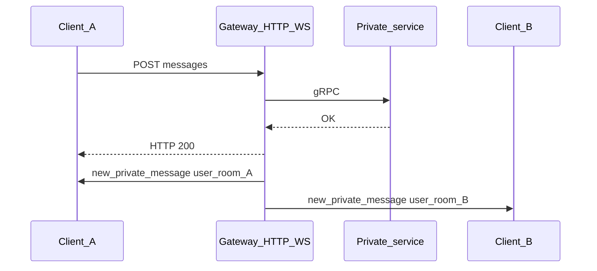

Документ для интеграции **real-time уведомлений** о личных сообщениях. Полный REST (отправка, история, ошибки) — в [FRONTEND_GATEWAY_API.md](./FRONTEND_GATEWAY_API.md).

**Кратко:**

- Сокет нужен только чтобы **слушать** события от сервера (`socket.on`).
- **Создание, правка и удаление сообщений** делайте **только через HTTP**. После успешного ответа gateway сам рассылает событие в Socket.IO — отдельно `emit` для этого не предусмотрено.
- После успешного `connect` сервер уже поместил сокет в персональную комнату; **ручного `join` с клиента не требуется** и отдельного события «подписаться на диалог» нет.

---

## Как это устроено



Оба участника диалога получают одни и те же типы событий в своей комнате `user_<userId>` — удобно для нескольких вкладок и устройств.

---

## 1. Зависимость и подключение

Установите клиент Socket.IO v4:

```bash
npm install socket.io-client
```

**Базовый URL** — тот же хост/порт, что и у REST gateway (например `http://localhost:3000`). В первый аргумент `io()` передавайте **`http://` или `https://`**. Схема `ws://` для handshake не рекомендуется. Путь по умолчанию: **`/socket.io/`**.

Рекомендуемый вариант авторизации — поле **`auth.token`** (сырой JWT **без** префикса `Bearer`):

```javascript
import { io } from 'socket.io-client';

const socket = io('http://localhost:3000', {
  auth: {
    token: accessToken,
  },
  transports: ['websocket'],
});
```

**Альтернатива** — заголовок (удобно не в браузере, а в Node/нативных клиентах; в браузере `extraHeaders` может быть недоступен):

```javascript
const socket = io('http://localhost:3000', {
  extraHeaders: {
    Authorization: `Bearer ${accessToken}`,
  },
  transports: ['websocket'],
});
```

На сервере префикс `Bearer ` снимается только с заголовка; в `auth.token` передавайте токен как есть.

После успешной верификации JWT пользователь из `sub` попадает в комнату **`user_<userId>`** автоматически — **ничего дополнительно вызывать не нужно**.

---

## 2. Жизненный цикл сокета

Подпишитесь на служебные события до или сразу после создания `socket` (порядок регистрации обработчиков до `connect` нормален).

| Событие | Что делать |
|--------|------------|
| **`connect`** | Считать канал готовым к приёму `new_private_message` и др. Можно снять флаг «переподключаемся». |
| **`disconnect`** | По желанию: индикатор офлайна, отложенный рефетч списков при возврате в `connect`. |
| **`connect_error`** | Сеть, неверный URL, CORS, недоступный сервер — до успешного handshake. Показать ошибку / повтор с backoff. |
| **`error`** | Отказ при подключении (часто невалидный или просроченный JWT). Тело см. ниже; соединение обычно закрывается. |

**Просроченный access token:** после `POST /auth/refresh` переподключите сокет с новым токеном. Практичные варианты:

- создать **новый** клиент: `oldSocket.disconnect()`, затем `io(url, { auth: { token: newAccess }, transports: ['websocket'] })`;
- или у одного инстанса: `socket.auth = { token: newAccess }; socket.disconnect(); socket.connect();` (актуально для версий клиента, где поддерживается смена `auth`).

---

## 3. События чата: скелет подписок

Все имена совпадают с [`ws-events.constant.ts`](../apps/gateway-service/src/messenger/constants/ws-events.constant.ts).

```javascript
socket.on('new_private_message', (payload) => {
  // Добавить/обновить сообщение в state для payload.conversationId
});

socket.on('private_message_edited', (payload) => {
  // Обновить текст и признак «изменено» для payload.messageId
});

socket.on('private_message_deleted', (payload) => {
  // Плейсхолдер «удалено» для payload.messageId или сверка с GET истории
});
```

| Событие | Когда приходит | Действие в UI |
|--------|----------------|---------------|
| **`new_private_message`** | После успешного `POST /private-chats/messages` | Вставить сообщение в ленту; по `senderId` отличать входящее/исходящее. |
| **`private_message_edited`** | После успешного `PATCH /private-chats/messages/:messageId` | Обновить текст/`editedAt` для `messageId` (редактировать может только автор). |
| **`private_message_deleted`** | После успешного `DELETE .../messages/:messageId?conversationId=...` | Soft-delete в UI; при необходимости уточнить поля через `GET .../messages`. |

Событие **`error`** при отказе в подключении:

```json
{
  "message": "Unauthorized connection",
  "details": "jwt expired"
}
```

---

## 4. Гонки, HTTP и дедупликация

- Push уходит **после** успешного HTTP. Если в этот момент сокет **ещё не подключён**, событие **не буферизуется** для клиента — его вы не получите позже.
- **Источник истины при открытии экрана чата** — `GET /private-chats/:conversationId/messages` (и ответ `POST` при отправке). Сокет дополняет live-обновлениями.
- **Оптимистичный UI:** привяжите черновик к `clientMessageId`, после ответа `POST` подставьте `messageId`. Со своей же отправки вы можете получить **`new_private_message` с тем же `messageId`** — храните сообщения по **`messageId`** и не дублируйте запись.

---

## 5. Поля payload (справка)

Типы на сервере: [`ws-message.dto.ts`](../apps/gateway-service/src/messenger/dtos/ws-message.dto.ts). Даты часто приходят **строками в Go-формате**; опциональные поля иногда как **пустые строки** `""` — закладывайте парсинг/проверку на пустоту.

**`new_private_message`** — ключевые поля: `messageId`, `clientMessageId`, `conversationId`, `senderId`, `text`, `hasAttachments`, `attachments`, `replyToMessageId`, `isPinned`, `editedAt`, `isDeleted`, `deletedAt`, `createdAt`, `updatedAt`, `deliveryStatus` (аналог `status` в HTTP-ответе отправки).

**`private_message_edited`:** `messageId`, `conversationId`, `senderId`, `text`, `editedAt`, `updatedAt`, `clientMessageId` (опционально).

**`private_message_deleted`:** `messageId`, `conversationId`, `deletedById`, `deletedAt`, `isDeleted`.

Компактные примеры:

```json
{
  "messageId": "91ca086a-645d-43d6-825b-b829c0ab2e88",
  "clientMessageId": "",
  "conversationId": "80068ed0-e7fc-4e33-a4a8-3d0cc3965de2",
  "senderId": "fea175c6-a326-4400-bcc2-ce73b88634c5",
  "text": "привет",
  "hasAttachments": false,
  "attachments": [],
  "replyToMessageId": "",
  "isPinned": false,
  "editedAt": "",
  "isDeleted": false,
  "deletedAt": "",
  "createdAt": "2026-03-25 15:02:32.271023728 +0000 UTC",
  "updatedAt": "2026-03-25 15:02:32.271023728 +0000 UTC",
  "deliveryStatus": "SENT"
}
```

```json
{
  "messageId": "6e3bf45a-b57c-4aeb-9bf2-18146403a294",
  "conversationId": "80068ed0-e7fc-4e33-a4a8-3d0cc3965de2",
  "senderId": "fea175c6-a326-4400-bcc2-ce73b88634c5",
  "text": "исправленный текст",
  "editedAt": "2026-03-25 15:02:40.708829978 +0000 UTC",
  "updatedAt": "2026-03-25 15:02:40.709045423 +0000 UTC",
  "clientMessageId": ""
}
```

```json
{
  "messageId": "6e3bf45a-b57c-4aeb-9bf2-18146403a294",
  "conversationId": "80068ed0-e7fc-4e33-a4a8-3d0cc3965de2",
  "deletedById": "fea175c6-a326-4400-bcc2-ce73b88634c5",
  "deletedAt": "2026-03-25 15:02:40.731739972 +0000 UTC",
  "isDeleted": true
}
```

---

## 6. Что не слать через сокет

Не используйте **`emit`** для отправки, правки или удаления сообщений — обработчиков под это на gateway нет.

| Действие | HTTP |
|----------|------|
| Новое сообщение | `POST /private-chats/messages` |
| Редактирование | `PATCH /private-chats/messages/:messageId` |
| Удаление | `DELETE /private-chats/messages/:messageId?conversationId=<uuid>` |

